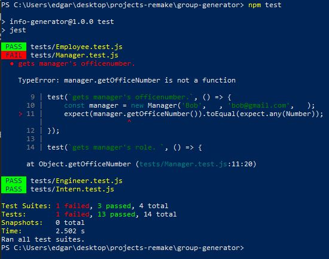
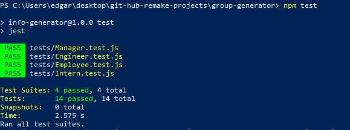
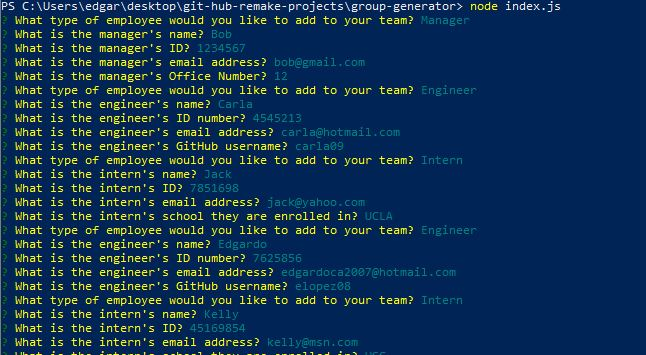
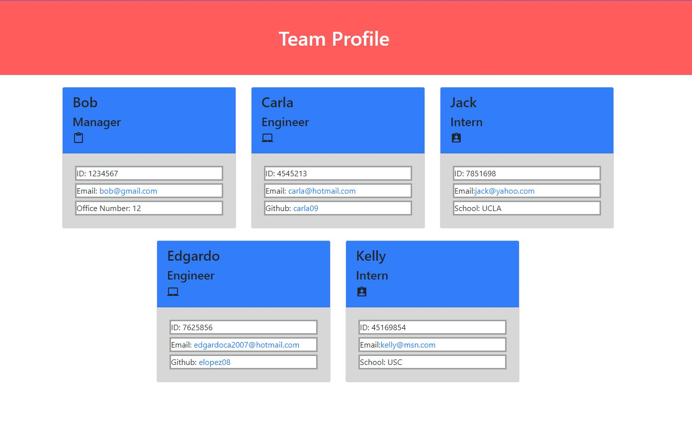
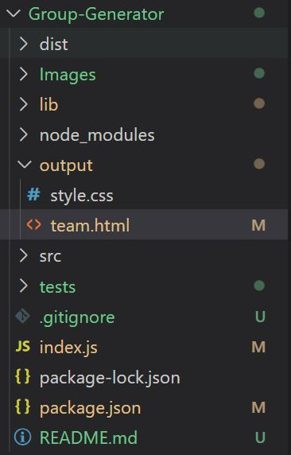

Group Generator!
===================

By Edgardo Lopez
----------------

##  Table of Contents

==============================================
*   [The Purpose](#the-purpose)
*   [Criteria](#criteria)
*   [Installation](#installation)
*   [Usage](#usage)
*   [The Process](#the-process)
*   [What Was Done Differently](#differently)
*   [Contributing](#contributing)
*   [Project Status](#project-status)
*   [Disclaimer](#disclaimer)
*   [Files Used](#files-used)
==============================================


#   [The Purpose](#the-purpose)

To generate a team that consists of employee, engineer, interns, and managers.  Once the system has been inputed, you are also able to view the member and its corresponding informatio on a card.

#   [Criteria](#criteria)

AS A manager
I WANT to generate a webpage that displays my team's basic info
SO THAT I have quick access to their emails and GitHub profiles

GIVEN a command-line application that accepts user input
WHEN I am prompted for my team members and their information
THEN an HTML file is generated that displays a nicely formatted team roster based on user input
WHEN I click on an email address in the HTML
THEN my default email program opens and populates the TO field of the email with the address
WHEN I click on the GitHub username
THEN that GitHub profile opens in a new tab
WHEN I start the application
THEN I am prompted to enter the team manager’s name, employee ID, email address, and office number
WHEN I enter the team manager’s name, employee ID, email address, and office number
THEN I am presented with a menu with the option to add an engineer or an intern or to finish building my team
WHEN I select the engineer option
THEN I am prompted to enter the engineer’s name, ID, email, and GitHub username, and I am taken back to the menu
WHEN I select the intern option
THEN I am prompted to enter the intern’s name, ID, email, and school, and I am taken back to the menu
WHEN I decide to finish building my team
THEN I exit the application, and the HTML is generated


#   [Installation](#installation)

Navigate to your folder that you want to put the files and then issue the command:

```bash
git clone https://github.com/elopez08/Group-Generator.git
```
Afterwards:
```bash
cd Group-Generator
code ..
```
Remember to use the "ls" command on the Command Prompt to see what folder/files are in it.


#   [Usage](#usage)

One of the first thing to do is test an output to show that the program is working as intended.  This is to see if we input an information in the system that it is going to work.  To do this, you'll need to issue the command on the commandpromopt:

```bash
npm test
```

Use this command on the folder "Group-Generator".  This will cause the program to run a "test" using the values that are found in the "tests" folder.  If you were to look at the contents inside the folder, you'll see that it consists of a set object such as this one in the employee.test:

  const employee = new Employee('Sam', 28, 'sammy@gmail.com');

What needs to happen is that it'll deploy this string of code and then tests to see what it is suppose to do.  In this case:

  expect(employee.name).toEqual(expect.any(String));
  expect(employee.id).toEqual(expect.any(Number));
  expect(employee.email).toEqual(expect.any(String));

This is important because we need to know what happens if the values that are being read are inputted in the system.  Should the system itself use said variables and then deploy it on the actual program, it needs to work.  Test allows this to test each of the .test.js to see which string holds true or not.  If something doesn't read right, it'll fail:




When we get a fail, this indicates that the code will not work if we were to run it, thus, we need to make some sort of change.  It'll either be on the code itself or perhaps that the input isn't being read properly.  Once you do the test, all of them should pass to ensure that the program will work as intended:



After testing, be sure to input the following command:

    node index.js

From there, it'll start inputting the Javascript that's in the index.js.  Everything else will then prompt to the questions that must be answered accordingly.


#   [The Process](#the-inquirer)

=================================

*   [The Inquirer](#the-purpose)
*   [Inside the Class](#inside-the-class)
*   [Regex](#regex)
*   [Generate HTML](#generate-html)


=================================

#   [The Inquirer](#the-purpose)

One of the things that needed to happen is establish on what the code is suppose to do.  Meeting the criterias that were mentioned, I deployed the "inquirer" function.  Here's an illustration on the general idea:

        inquirer.prompt([{
            type: "list",
            message: "What type of employee would you like to add to your team?",
            name: "addEmployeePrompt",
            choices: ["Manager", "Engineer", "Intern", "No more team members are needed."]
            }])

Inquirer is an operation that is structured in a way to essentially have a question which will follow up by an answer.  In this case, it goes something like this:

First, it determins the type.  This can be either a string of code, number, or in the sample above, a list of arrays that'll be given a choice.  For more information on how that's determined, I encourage to go to:  https://www.npmjs.com/package/inquirer



Next, message displays on what the console.log will show as a message to the user.  Since we're asking a series of questions on what needs to be added, it'll be defined as a question.  Remember that a message is just a string and a visual aid for the user.

Next is the name.  This is IMPORTANT.  Essentially, it is the input of the user.  Or more in particular, the name of the input.  We'll get more of a visual representation on this when we discuss in generating an HTML.  For now, let's move on to what are the steps taken to make the code.

Using the sample above, this is pretty much the head.  It's asking what type of employee will be added.  We then follow it up with the next procedure:  A promise:

            .then(function (userInput) {
                //We're going to go by the cases.  That addEmployeePrompt is the name of the property from above.  So when we choose "Manager", that will now convert to that name from the userInput
                    switch(userInput.addEmployeePrompt) {
                    case "Manager":
                        //Switch this to the function down below
                        addManager();
                        break;
                    case "Engineer":
                        addEngineer();
                        break;
                    case "Intern":
                        addIntern();
                        break;
            
                    //If this option is selected, then that means it'll go straight to the builder, which means it'll end the code running.
                    default:
                        htmlBuilder();
                    }
            })
    }

The ".then" is a promise that initiates AFTER the statement above has been issued.  This is similar to the weather project, which can be found here: ((insert Weather Report))

The function has a "userInput".  This is the string that was selected when "choices" was issued.  So for example, if the string choice was "Manager", that will be transferred as the "userInput", aka, "userInput = "Manager".  Once that's done, it'll then go to a switch statement:

            switch(userInput.addEmployeePrompt) {

To give a bit of a small hint on what's to come, notice that it has "addEmployeePrompt".  That was the name.  Keep this in mind since this will be a CRUCIAL thing when making the HTML.  For now, let's go to the "Manager" case:

                    case "Manager":
                        //Switch this to the function down below
                        addManager();
                        break;

So once it finds a match, it'll then do the function "addManager()".  This will cause the code to jump to that function.  In short, for now, this loop is now on hold.  We move on to the function.

    function addManager () {
        inquirer.prompt([
            {
                type: "input",
                name: "managerName",
                message: "What is the manager's name?",
                validate: nameinput => {
                    if(nameinput)
                    {
                        return true;
                    }
                    else
                    {
                        console.log(`Please type in the manager's name! (Required)`);
                        return false;
                    }
                }
            },

Once we're in the function, inquirer is issued again.  This time, it's asking for an "input".  For this, the user would then have to issue a line of string.  This is where you need to type the name.  Should there be a string, then it'll "return true", which will then cause this loop to end and move on to the next array.  However, should there not be anything, the console.log will inform the user to type in a manager name.  Then, it is return false.  This means that it'll go in the same inquirer array loop again asking for the name.  Once that's done, then it'll move on to the next array, which in this case, is this:

            {
                type: "input",
                name: "managerID",
                message: "What is the manager's ID?",
                validate(idnumber) {
                    manageridRegex = /^[$]?\d{7}[\d{7},]*$/
                    if(!manageridRegex.test(idnumber))
                    {
                        return `Not a valid ID Number.  Please type in a 7 digit ID number for the manager.`;
                    }
                    else
                    {
                        return true;
                    }
                }

            },

This pattern continues until the final question.  When the final "return true" is issued, this happens:

        ]).then(answers => {
            const manager = new Manager(answers.managerName, answers.managerID, answers.managerEmail, answers.managerOfficeNumber);
            //Returning the sender back to the beginning
            createGroup();
        });

Now what it is doing is using the identity "const manager", it'll store it in an array that said information that is being inputed.  Note, though, there's another thing going on:  new Manager

This is where the test helped out in the beginning.  By saying "new Manager", we're issuing the manager.js.  This is becauase  in the beginning, this was defined:

const Manager = require("./lib/manager.js");

When the "new Manager" is called, it'll go to that file.  We'll now look into what this is doing.


#   [Inside the Class](#inside-the-class)

Using the Manager as an example, this happens:

```bash
const Employee = require("./Employee");

class Manager extends Employee {
    constructor (name, id, email, officeNumber) {
        super (name, id, email);
        this.officeNumber = officeNumber;
    }

    
    getOfficeNumber() {
        return this.officeNumber;
    }

    //When we go to the generateHTML, we have this as a returned value.  It'll match in the property there
    getRole() {
        return "Manager";
    }
}

//This one is IMPORTANT
module.exports = Manager;
```

Now, following the properties that we obtained, we then go to the class Manager extends Employee.

First, it'll call upon the "constructor" and then it'll store in the values of the name, id, email, and officeNumber.

To recall, this is what happened in the end:

            const manager = new Manager(answers.managerName, answers.managerID, answers.managerEmail, answers.managerOfficeNumber);

Using "answers.managerName" as an example, it takes that and applies it to "name" of the Manager.  This is then stored, but do you see the "super" part?  There's ANOTHER thing that happens:  Employee.  Now we need to bounce back again, but this time in the "employee.js".  When you look into that file, you'll noticed:

class Employee {
    constructor (name, id, email) {
        this.name = name;
        this.id = id;
        this.email = email 
    }

Why mentioned this, though?  That is because "super" is pretty much a common link.  If you were to look at "engineer.js" and "intern.js", you'll notice that those, too, have supers.  That is because "Employee" has the properties of "name", "id", and "email".  Since these properties are common for all three, we can issue a parental property.  In each of the other .js in the "lib" folder, it'll be defined as a "super".  Rather than have a separate detail on each of them, we can add all of it with the same property n the Employee.  If you noticed, Employee has a return value on these properties such as:

    getName () {
        return this.name;
    }

Without super, we have to include this on all of them.  To save a bit of code, we can just have Employee be the one to do this while the rest focuses on their own unique properties.  For example, Manager has an "officeNumber".  This unique property is ONLY for Manager, so we have to do this:

        this.officeNumber = officeNumber;

Then we do this:

    getOfficeNumber() {
        return this.officeNumber;
    }

Finally, after navigating through the code, we do this:

            createGroup();

What this is doing is recalling the function AGAIN. The user will be able to add another information in the system based on the question.  To save a very lengthy explanation, all the questions behave in a matter that is being described.  One thing to note, though, is the use of another function that was inputted in the code:  Regex.

#   [Regex](#regex)

Let's use this example here:

            {
                type: "input",
                name: "internID",
                message: "What is the intern's ID?",
                validate(internidnumber) {
                    idRegex = /^[$]?\d{7}[\d{7},]*$/
                    if(!idRegex.test(internidnumber))
                    {
                        return `Not a valid ID Number.  Please type in a 7 digit ID number for the manager.`;
                    }
                    else
                    {
                        return true;
                    }
                }
            },

The question would be why use a Regex?  This is where you can do something sneaky.  Recall the very first question of the Manager:

            {
                type: "input",
                name: "managerName",
                message: "What is the manager's name?",
                validate: nameinput => {
                    if(nameinput)
                    {
                        return true;
                    }
                    else
                    {
                        console.log(`Please type in the manager's name! (Required)`);
                        return false;
                    }
                }
            },

Notice that the only thing that is saying is "if(nameinput)"?  This is the ONLY check.  In order to "pass" this, you simply need to type in a character.  This means someone can do something as "1" or "/".  Heck, you can even put: "B055" and all of it works.  Test it out and you'll see the results (Hint, this was INTENTIONAL).

Getting back to the code before:

                validate(internidnumber) {
                    idRegex = /^[$]?\d{7}[\d{7},]*$/
                    if(!idRegex.test(internidnumber))
                    {
                        return `Not a valid ID Number.  Please type in a 7 digit ID number for the manager.`;
                    }

It'll go through a validation on the input of the user.  It then issues an idRegex to be:

    /^[$]?\d{7}[\d{7},]*$/

This sounds confusing, but basically what this is saying is you MUST have at least 7 characters that are numbers.  This can get overwhelming in deciphering the code, so I encourage you to go to: https://regex101.com/. Use that and see how it is done.

Put in this character and you'll see what it is trying to say.

Now, type in any character you like.  Did it fail?  Most likely, it is going to.  And the reason why is because of the Regex.  So now the user is forced to input to meet the Regex standards.  In this case, ONLY NUMBERS are allowed and YOU MUST have 7 of them in a string to work.  Now input the number and you'll see that it does pass.

So now the question is:  How do we generate the HTML in the first place?  This is from the last case:

                    default:
                        htmlBuilder();
                    }

This will cause this to trigger:

    function htmlBuilder () {
        console.log(`The team has been created!`)
        fs.writeFileSync(outputPath, generateHTML(teamArray), "UTF-8")
    }

With all that in mind, what does this do?  We need to see what each of the files mean.  First, we have outputPath, which is defined here:

const outputPath = path.join(OUTPUT_DIR, "team.html");

OUTPUT_DIR is this:

const OUTPUT_DIR = path.resolve(__dirname, "output");

In short, this is saying that the path is found in the "output" folder and it is going to the "team.html".  Next, we have "generateHTML(teamArray)".

const generateHTML = require("./src/generateHTML.js");

From this, we are going to the "src" folder and we're going to the "generateHTML.js" file.  

This... is where we now move to the meat of the code:  Generating the HTML.

#   [Generate HTML](#generate-html)



This is going to be lengthy to explain, so we'll stick with the manager information.  After inputting the manager, we then move onto the code:

First, this triggers:

generateHTML = (data) => {

With this in mind, the data that we just received (ALL OF IT, by the way), will then be put into a separate array:

    pageArray = []; 

Knowing this, we then have a length.  This is the next part:

    for (let i = 0; i < data.length; i++) {
        const employee = data[i];
        const role = employee.getRole(); 

Using the "data" array, we then issue how big it is by putting ".length" in it.  With this, we can use it on the "for" loop.  This is fine since we're still going to go each array depending on what number we're on.  To recall, "0" is the first of the array, so when "employee = data[i]" is called, it is referring to the first data of the array.  Knowing this, it'll then extract the role with ".getRole()" thanks to the property that was established.  We then go to the if statements.  Since we're in Manager, we'll do this one:

        if (role === 'Manager') {
            const managerCard = generateManager(employee);
            pageArray.push(managerCard);
        }


Now, withthis, we can then move on to the next function:  generateManager(employee).

From the top, we have this:

    const generateManager = function (manager) {
        return `
        <div class="col-4 mt-4">
            <div class="card h-100">
                <div class="card-header">
                    <h3>${manager.name}</h3>
                    <h4>Manager</h4><i class="material-icons">content_paste</i>
                </div>
                <div class="card-body">
                    <p class="id">ID: ${manager.id}</p>
                    <p class="email">Email: <a href="mailto:${manager.email}">${manager.email}</a></p>
                    <p class="office">Office Number: ${manager.officeNumber}</p>
                </div>
            </div>
        </div>
        `;
    }

So this is essentially writing a line of string.  Note that this is similar to an HTML code.  We're going to be displaying the cards depending on what we answered in the inquirer and it all depends on what the type is.  For the manager, it looks like what is shown above.  That will be the return value.  This will then be pushed into an array on "managerCard".  It'll continue going on the loop, putting all the strings into arrays of "pageArray".  When that's done, this happens:

    const employeeCards = pageArray.join('')

In short, it's taking out the ",".  We need to do that or the "," will show up on the HTML.  Finally, we do this:

      const generateTeam = generateTeamPage(employeeCards); 

This will trigger a final function:

const generateTeamPage = function (employeeCards) {   

Recall that because we have "employeeCards", we'll be setting that to the FUNCTIONS "employeeCards".  Everything inside this funciton is "orange", so it'll just be a written information for the HTML.  All of it except for ONE thing:

                    <!--Team Cards-->
                    ${employeeCards}

This is the important one out of all of them.  The "${}" is significant.  This is basically going to write DEPENDING on the properties of "employeeCards".  Unlike the rest that are in orange text that is being set already, this one DEPENDS on what the property holds.  After all of that, we will then have the output be set on "team.html", thus, finally generating the team.



#   [What Was Done Differently](#differently)

Honestly, since there's no README to go by or due to learning Regex almost right away, the one thing that was done differently was the Regex itself.  It may not be much now since we're answering the questions as intended, but if a random user were to make a small mistake or if they just brute force on the questions (like the name putting as "3"), it'll bypass it, defeating the purpose of generating the team.  This is why I made it in the first place.

#   [Contributing](#contributing)
Made by Edgardo Lopez

#   [Project Status](#project-status)

This is an ungoing project that will be used to continue to make improvements if necessary.
Last updated:  July 25, 2022


#   [Disclaimer](#disclaimer)

#   [Files Used](#files-used)
* JavaSript
* HTML
* CSS